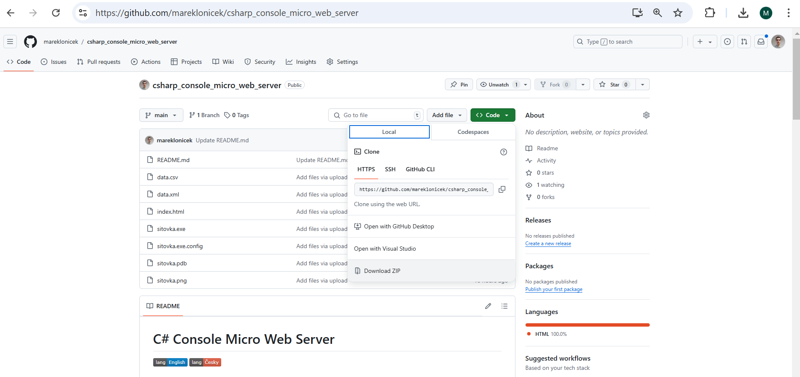
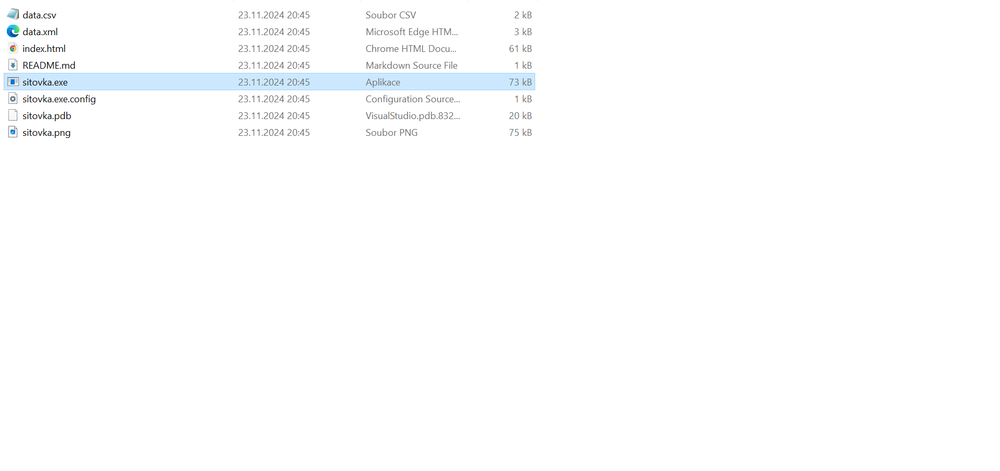
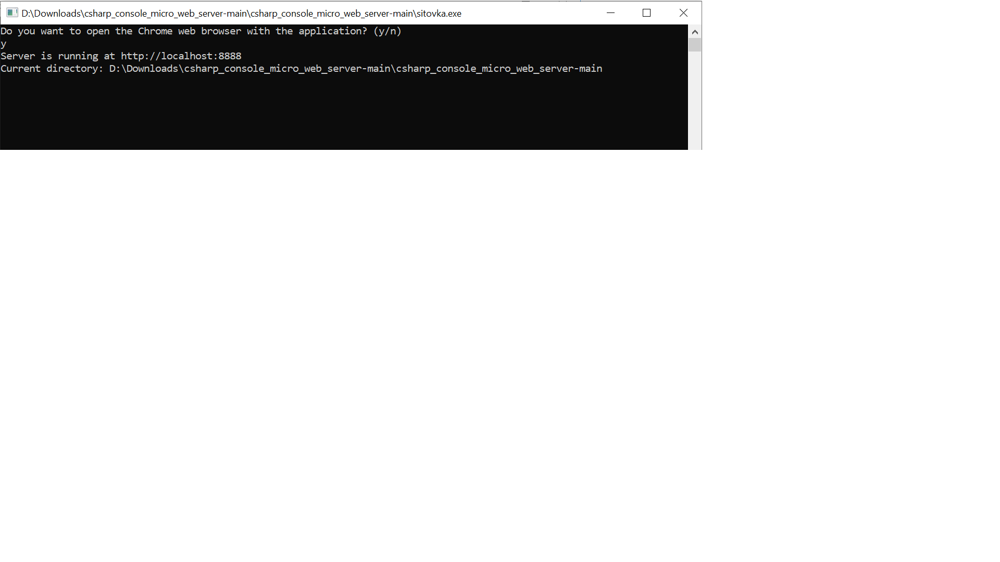
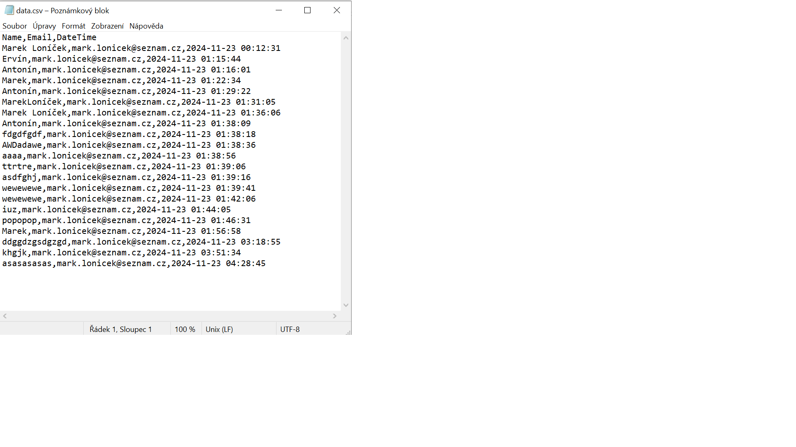
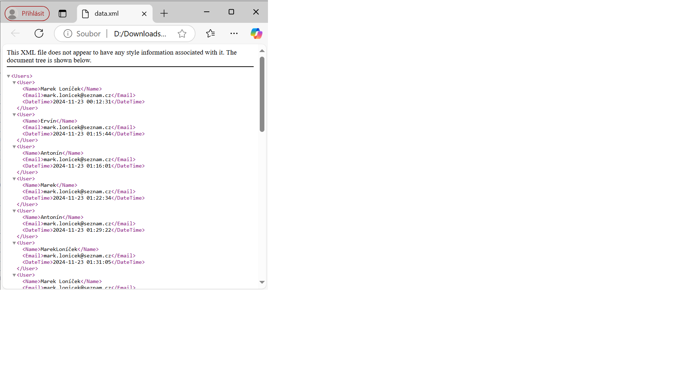
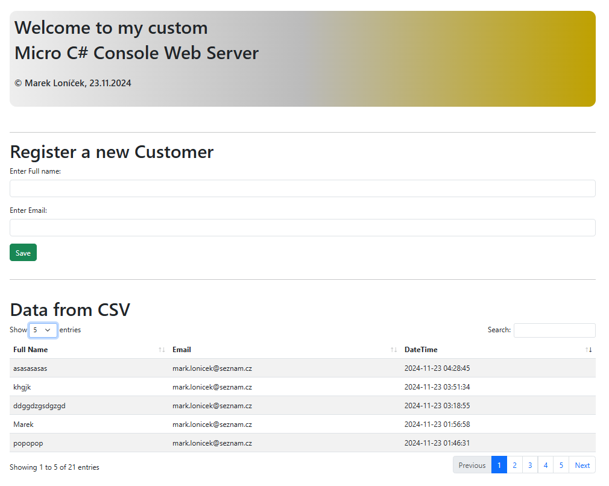

# C# Console Micro Web Server

---

##  English

### I have developed a lightweight micro web server in C#, designed to run directly from the console. It is simple, efficient, and allows for immediate testing and data storage.

---

### Table of Contents
1. [Download](#download)
2. [Setup and Installation](#setup-and-installation)
3. [How to Use](#how-to-use)
4. [License](#license)

---

### Download

1. Click on the **Code** (green button) in the upper-right corner of the repository. Select **Download ZIP**.
2. Extract the ZIP file on your computer. Locate and run the executable file "**sitovka.exe**" (confirm any firewall prompts if necessary).
3. The program will launch a console. By default, the server should open in Chrome. If not, manually enter the URL "**http://localhost:8888**" into your browser. All data is automatically stored in the provided CSV and XML files.
4. &copy; Marek Loníček, 23.11.2024

---

##  Česky

### Vytvořil jsem lehký mikro webový server v C#, který běží přímo z konzole. Je jednoduchý, efektivní a umožňuje okamžité testování a ukládání dat.

---

### Obsah
1. [Stažení](#stažení)
2. [Instalace a nastavení](#instalace-a-nastavení)
3. [Použití](#použití)
4. [Licence](#licence)

---

### Stažení

1. Klikněte na **Code** (zelené tlačítko) v pravém horním rohu repozitáře. Vyberte **Download ZIP**.
2. Rozbalte stažený ZIP soubor na vašem počítači. Najděte a spusťte spustitelný soubor "**sitovka.exe**" (potvrďte případná upozornění od firewallu).
3. Program se spustí v konzoli. Výchozí nastavení otevře server v prohlížeči Chrome. Pokud ne, zadejte adresu "**http://localhost:8888**" do svého prohlížeče. Data se automaticky ukládají do přiložených souborů CSV a XML.
4. &copy; Marek Loníček, 23.11.2024

---

