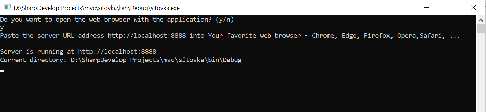

 # <a id="up">C# Console Micro Web Server</a>

##   [Project Overview Video on YouTube](https://www.youtube.com/watch?v=zTt-5AbQsSk)
   
 

   

---

##  Welcome!

### I have developed a lightweight micro web server in C#, designed to run directly from the console. It serves web content to the browser while enabling data management and storage in CSV and XML formats. Simple and efficient, it allows for immediate testing and easy prototyping, making it ideal for lightweight applications.

---

### Table of Contents
1. [Download](#download)
2. [Setup and Installation](#setup-and-installation)
3. [How to Use](#how-to-use)
4. [Dokumentation](#docs-eng)
5. [License](#license)

---

###  1. Download

→ Click on the **`Code`** (green button) in the upper-right corner of the repository. 

→ Select **`Download ZIP`**. Extract the ZIP file on your computer.

---
###  2. Setup and Installation

→ Extract the ZIP file on your computer.

→ Locate and run the executable file **`sitovka.exe`** (confirm any firewall prompts if necessary).

---
###  3. How to Use

→ The program will launch a console. 

→ Paste the server URL address **`http://localhost:8888`** into Your favorite web browser - Chrome, Edge, Firefox, Opera,Safari,...

→ All data is automatically stored in the provided CSV and XML files.

---
###  4. Documentation

→ English html documentation is in the **`documentation.rar`** file.

---

###  5. License

&copy; Marek Loníček, 23.11.2024

---

##  Vítejte!

### Vytvořil jsem lehký mikro webový server v C#, který běží přímo z konzole. Je jednoduchý, efektivní a umožňuje okamžité testování a ukládání dat.

---

### Obsah
1. [Stažení](#stažení)
2. [Instalace a nastavení](#instalace-a-nastavení)
3. [Použití](#použití)
4. [Dokumentace](#docs-cze)
5. [Licence](#licence)

---

###  Stažení

→ Klikněte na **`Code`** (zelené tlačítko) v pravém horním rohu repozitáře. 

→ Vyberte **`Download ZIP`**. Rozbalte ZIP soubor na vašem počítači.

---
###  Instalace a nastavení

→ Rozbalte ZIP soubor na vašem počítači. 

→ Najděte a spusťte spustitelný soubor **`sitovka.exe`** (potvrďte případná upozornění od firewallu).

---
###  Použití

→ Program se spustí v konzoli.

→ Vložte adresu serveru **`http://localhost:8888`** do Vašeho oblíbeného webového prohlížeče – Chrome, Edge, Firefox, Opera, Safari,...

→ Data se automaticky ukládají do přiložených souborů CSV a XML.

---

###  4. Documentace

→ Česká html dokumentace je v **`documentation.rar`** souboru.

---
###  5. Licence

&copy; Marek Loníček, 23.11.2024

---

